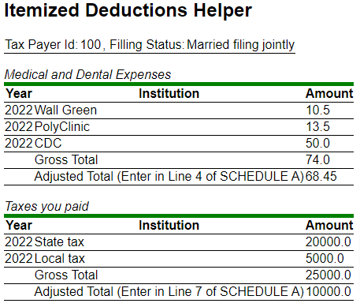

**About**:
Tax project is a web app which models data and logic of Itemized Deductions Tax Form, built by using Maven and Spring Boot. 

**Current functionality**:
The program loads initial data of tax payers and expense data from file system to H2 database, calculates deductable amount based on the tax category, and displays a report per user or all users:

- A View for an indididual tax payer is accessed by http://localhost:8080/tax/report/{taxpayerid}/{year}:

- A View for all tax payers records is accessed by http://localhost:8080/tax/reports:

**Future Steps**:
- Complete DeductionItem by adding other deductions categories to the model.

- Enhance DeductionItem by adding a receipt to each expense record.
- Add abilities to modify data from UI. 
